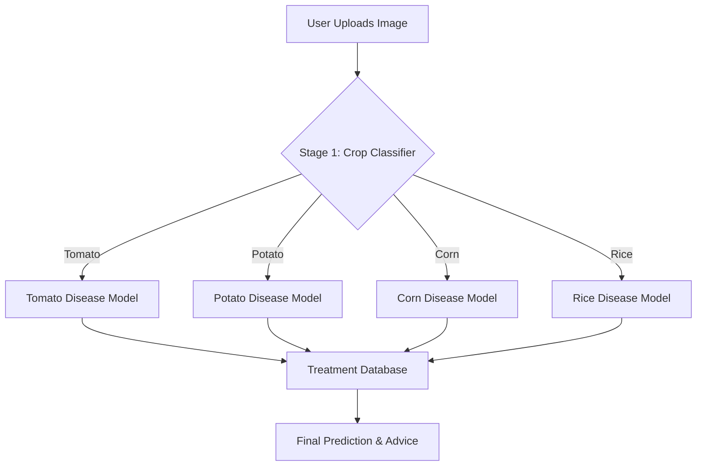

# 🌿 PlantGuard AI — Two-Stage Crop Disease Predictor

A production-structured, beginner-friendly deep learning web application designed to identify crop types and detect diseases with high precision.

> [!NOTE]
> This project uses a two-stage pipeline: first identifying the crop (Tomato, Potato, Corn, etc.), then using a specialized model for that specific crop to identify the disease.

## ✨ Key Features
- **Stage 1 (Crop Detection)**: Identifies the crop type from a leaf image.
- **Stage 2 (Disease Detection)**: Detects the specific disease using a crop-specific specialized model.
- **Treatment Recommendations**: Provides actionable advice, prevention methods, and severity assessment.
- **Modern UI**: Clean, responsive web interface for easy interaction.
- **REST API**: Detailed JSON responses for integration with other services.

---

## 🏗️ Architecture



---

## 📁 Project Structure

```text
plant disease predictor/
├── data/
│   ├── raw/                         # ← Put your dataset here
│   └── treatments.json              # Disease treatment database
├── models/                          # Trained .h5 models & class mappings
├── utils/
│   └── preprocessing.py             # Image preprocessing logic
├── training/
│   ├── train_crop_classifier.py     # Stage 1 training script
│   ├── train_disease_classifier.py  # Stage 2 training script
│   └── evaluate_model.py            # Model evaluation utilities
├── prediction/
│   └── predict.py                   # Two-stage prediction pipeline
├── static/                          # Frontend assets (CSS, JS, Uploads)
├── templates/
│   └── index.html                   # Main UI
├── app.py                           # Flask web server
└── requirements.txt                 # Project dependencies
```

---

## ⚡ Quick Start

### 1. Setup Environment
```bash
# Create and activate virtual environment
python -m venv venv
# Windows:
venv\Scripts\activate
# macOS/Linux:
source venv/bin/activate

# Install dependencies
pip install -r requirements.txt
```

### 2. Run the Web App
```bash
python app.py
```
Visit **http://127.0.0.1:5000** in your browser.

---

## 🧠 Training & Evaluation

### Stage 1 — Crop Classifier
```bash
python training/train_crop_classifier.py
```
- Trains on all crop folders in `data/raw/train/`.
- Saves to `models/crop_model.h5`.

### Stage 2 — Disease Classifiers
```bash
# Train for a specific crop:
python training/train_disease_classifier.py --crop tomato

# Train all supported crops:
python training/train_disease_classifier.py --crop all
```

> [!TIP]
> For better accuracy, ensure you have at least 200 images per class. The pipeline uses **Transfer Learning** with MobileNetV2 and **Data Augmentation** for robust performance.

---

## 📊 Supported Diseases

| Crop   | Supported Disease Classes |
| :--- | :--- |
| **Tomato** | Early Blight, Late Blight, Leaf Mold, Septoria Leaf Spot, Healthy |
| **Potato** | Early Blight, Late Blight, Healthy |
| **Corn** | Common Rust, Northern Leaf Blight, Healthy |
| **Rice** | Brown Spot, Bacterial Blight, Leaf Smut, Healthy |

---

## 📋 API Reference

### `POST /predict`
Upload a leaf image and get a detailed diagnosis.

**Response Example:**
```json
{
  "success": true,
  "crop": "tomato",
  "crop_confidence": 97.3,
  "disease": "early_blight",
  "disease_confidence": 89.1,
  "treatment": {
    "display_name": "Early Blight",
    "severity": "Moderate",
    "description": "...",
    "treatment": ["..."],
    "prevention": ["..."]
  }
}
```

---

## 🌐 Deployment

### Production with Gunicorn
```bash
pip install gunicorn
gunicorn -w 2 -b 0.0.0.0:5000 app:app
```

### Deploy to Render
1. Push to GitHub.
2. Connect repo to [Render](https://render.com).
3. Build Command: `pip install -r requirements.txt`.
4. Start Command: `gunicorn app:app`.

---

## 🤝 Contribution
Contributions are welcome! If you have suggestions for new features or improvements, please feel free to open an issue or submit a pull request.

## 📄 License
This project is licensed under the MIT License - see the LICENSE file for details.